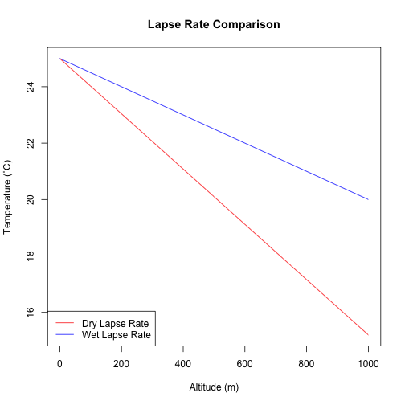

Parachute Utility - Helping Novice Rocketeers Save Thier Rockets
========================================================
author: Akshaya Srivastava
date: September 21, 2014

Why Model Rockets?
========================================================

- Rockets have been around since the ancient chinese developed gunpowder and used 
it to make fireworks, albeit not in it's curent form

- Model Rocketry has been regarded as an educative tool and has been credited with
helping many budding scientists and engineers find thier roots.

- Model Rocketry involves building a complex rocket (duh), and as sucb, the 
calculations can become very tedios. Thus, every little bit of help is appreciated.

Ok, so where does Parchute Sizing Utility come in?
========================================================

* The sizing utility allows a user to calculated how much parachute they would need
for a safe recovery.

* It is can take into account:
    * Motor size (which leads to the height)
    * Weight (the mass of the rocket)
    * Profile of the rocket (the coefficient of drag, or Cd)
    * Wind speed

Is that all it does?
========================================================

- Well...yes. 

- The tool also assumes a standard atmosphere and a static air density. It also
assumes that the landing speed is fixed at 20 feet/second

- At this point, we don't have the funding to put out a product that can handle
more difficult computations.

Oh! Well, when can we expect those newfangled thingamabobs?
========================================================

 
***
Some of the difficulties in implementing new features are intricate calculations
involving the estimated humidity of air and the height, which would lead to a 
changing pressure and density upon decent. As the graph shows, 0% humidity and 
30% humidity are vastly different, empirically.

So what you're saying is...?
========================================================

- There are many improvements down the line. 

- Involve solving complex problems and equations that are not trivial to solve
and highly depend on the assumptions made.

- More funding is necessary in order to complete the product with all of the 
various features and calculations.
